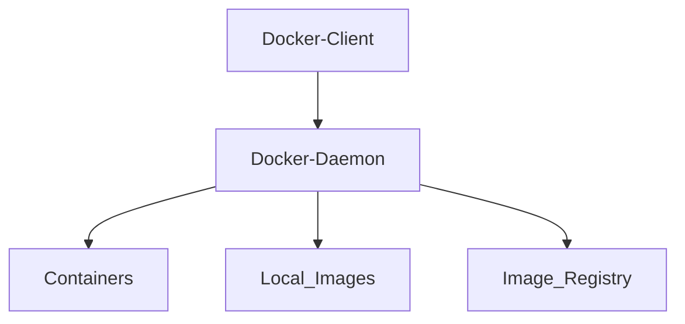

# Docker

## Architecture



## Installation

To install on your windows,macOs, linux or wsl. Please follow these steps:

- For Linux follow these [steps](https://docs.docker.com/desktop/install/linux-install/)
- For Windows follow these [steps](https://docs.docker.com/desktop/install/windows-install/)
- For MacOS follow these [steps](https://docs.docker.com/desktop/install/mac-install/)

## Docker commands

```bash
docker --version
docker run -p 5000:5000 home/hello-world-python:0.0.1.RELEASE
docker run -p 5000:5000 home/hello-world-java:0.0.1.RELEASE
docker run -p 5000:5000 home/hello-world-nodejs:0.0.1.RELEASE
docker run -d -p 5000:5000 home/hello-world-nodejs:0.0.1.RELEASE
docker run -d -p 5001:5000 home/hello-world-python:0.0.1.RELEASE
docker logs 04e52ff9270f5810eefe1f77222852dc1461c22440d4ecd6228b5c38f09d838e
docker logs c2ba
docker images
docker container ls
docker container ls -a
docker container stop f708b7ee1a8b
docker run -d -p 5001:8080 home/hello-world-rest-api:0.0.1.RELEASE
docker pull mysql
docker search mysql
docker image history home/hello-world-java:0.0.1.RELEASE
docker image history 100229ba687e
docker image inspect 100229ba687e
docker image remove mysql
docker image remove home/hello-world-java:0.0.1.RELEASE
docker container rm 3e657ae9bd16
docker container ls -a
docker container pause 832
docker container unpause 832
docker container stop 832
docker container inspect ff521fa58db3
docker container prune
docker system
docker system df
docker system info
docker system prune -a
docker top 9009722eac4d
docker stats 9009722eac4d
docker container run -p 5000:5000 -d -m 512m home/hello-world-java:0.0.1.RELEASE
docker container run -p 5000:5000 -d -m 512m --cpu-quota=50000  home/hello-world-java:0.0.1.RELEASE
docker system events

docker container stats 4faca1ea914e3e4587d1d790948ec6cb8fa34f26e900c12632fd64d4722fd59a
docker stats 42f170966ce613d2a16d7404495af7b3295e01aeb9142e1fa1762bbdc581f502

cd /home/git/devops-master-class/projects/hello-world/hello-world-python
docker build -t home/hello-world-python:0.0.2.RELEASE .
docker run -p 5000:5000 -d home/hello-world-python:0.0.2.RELEASE
docker history e66dc383f7a0
docker push home/hello-world-python:0.0.2.RELEASE

cd ../hello-world-nodejs/
docker build -t home/hello-world-nodejs:0.0.2.RELEASE .
docker container run -d -p 5000:5000 home/hello-world-nodejs:0.0.2.RELEASE
docker push home/hello-world-nodejs:0.0.2.RELEASE

cd ../hello-world-java/
docker build -t home/hello-world-java:0.0.2.RELEASE .
docker run -d -p 5000:5000 home/hello-world-java:0.0.2.RELEASE
docker push home/hello-world-java:0.0.2.RELEASE

docker run -d -p 5001:5000 home/hello-world-nodejs:0.0.3.RELEASE ping google.com


docker run -d -p 8000:8000 --name=currency-exchange home/currency-exchange:0.0.1-RELEASE
docker run -d -p 8100:8100 --name=currency-conversion home/currency-conversion:0.0.1-RELEASE

docker network ls
docker network inspect bridge

docker run -d -p 8100:8100 --env CURRENCY_EXCHANGE_SERVICE_HOST=http://currency-exchange --name=currency-conversion --link currency-exchange home/currency-conversion:0.0.1-RELEASE

docker network create currency-network
docker container stop currency-exchange
docker container stop currency-conversion
docker run -d -p 8000:8000 --name=currency-exchange --network=currency-network home/currency-exchange:0.0.1-RELEASE
docker run -d -p 8100:8100 --env CURRENCY_EXCHANGE_SERVICE_HOST=http://currency-exchange --name=currency-conversion --network=currency-network home/currency-conversion:0.0.1-RELEASE

docker-compose --version
cd ../../microservices/
docker-compose up
docker-compose up -d
docker container ls
docker network ls
docker network inspect microservices_currency-compose-network
docker-compose down
docker container ls -a
docker system prune -a
docker-compose config
docker-compose images
docker-compose ps
docker-compose top
```
